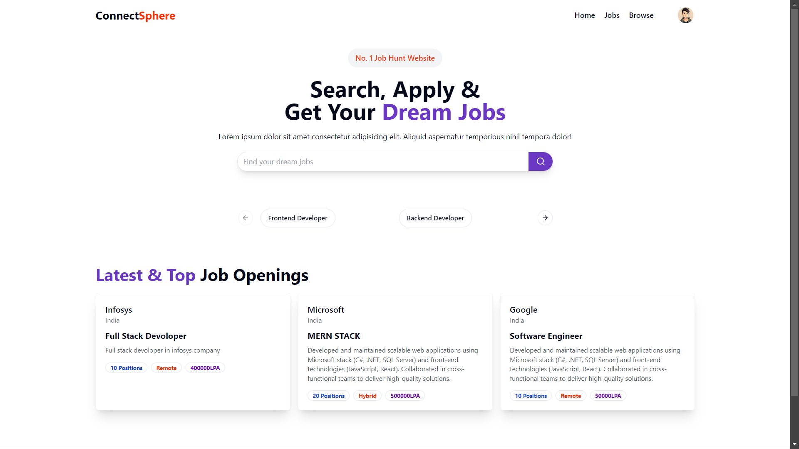
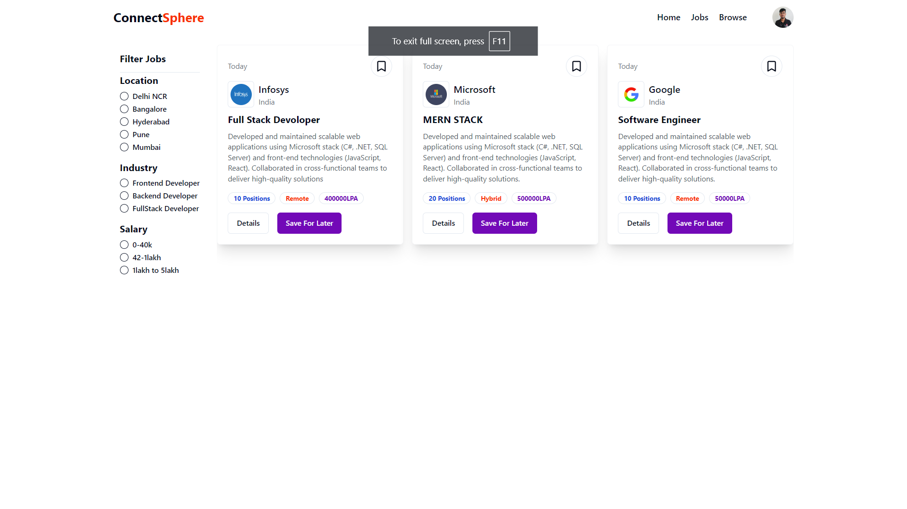

# ConnectSphere

**ConnectSphere** is a dynamic job portal application designed to bridge the gap between students, recruiters, and companies. The platform facilitates job applications, profile management, and job postings, offering a streamlined experience for all users. Built with Node.js, MongoDB, and React, the application incorporates modern web technologies including Redux, Context API, and Multer for file handling.

## Deployment

- **Backend**: [ConnectSphere Backend](https://connectsphere-server.onrender.com/)
- **Client**: [ConnectSphere Client](https://connect-sphere-client.vercel.app/)

## Features

- **For Students**:
  - Create and manage profiles
  - Upload resumes
  - Browse and apply for job opportunities


### Admin Panel
- **Manage Recruiters**: Add, edit, and delete recruiter profiles.
- **Manage Companies**: Add, update, and remove company profiles.
- **Manage Job Postings**: Create, update, and delete job listings.
- **Student Oversight**: View and manage student profiles and job applications.

### Recruiter Panel
- **Post Job Openings**: Create and manage job listings.
- **Manage Applications**: View, filter, and manage student applications.
- **Search Student Profiles**: Search and view student profiles based on skills and other criteria.

### User Dashboard


### Student Panel
- **Registration and Login**: Sign up and log in to access the platform.
- **Profile Management**: Create and update student profiles, including skills and education.
- **Resume Upload**: Upload resumes to Cloudinary for easy management.
- **Job Applications**: Apply for jobs and track application status.

## Technologies Used

- **Backend**: Node.js, Express, MongoDB
- **Frontend**: React, Context API, Hooks, Redux
- **File Uploads**: Multer
- **Cloud Storage**: Cloudinary
- **Authentication**: JWT (JSON Web Tokens)
- **Deployment**: AWS, Vercel

## Installation
### Backend

1. **Clone the Repository:**
   ```bash
   git clone https://github.com/sujoyghoshal/ConnectSphere.git

### Jobs
